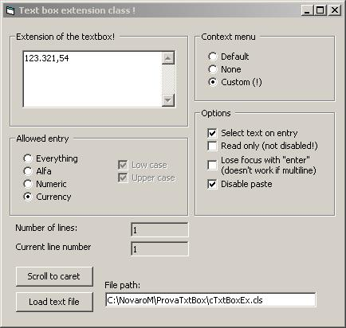



## New textbox wrapper class\!\!

### Description

Here it is! Want to enter only numbers in a textbox? Or only

currency? And avoid users paste something that is not valid? Try

this! This is a class module that lets you turn a standard textbox

into a new one, that accepts only numbers (also decimal).

The decimal and currency separators depends on the locale settings, and are read

via API!

New features added also!! Check it out!
 
### More Info
 
Note: to run this, you have to download and register the SSUBTMR6.DLL

from www.vbaccelerator.com

             |
---                |---
**Submitted On**   |2002-08-25 17:21:58
**By**             |[M\. Novaro](https://github.com/Planet-Source-Code/PSCIndex/blob/master/ByAuthor/m-novaro.md)
**Level**          |Intermediate
**User Rating**    |5.0 (20 globes from 4 users)
**Compatibility**  |VB 6\.0
**Category**       |[Custom Controls/ Forms/  Menus](https://github.com/Planet-Source-Code/PSCIndex/blob/master/ByCategory/custom-controls-forms-menus__1-4.md)
**World**          |[Visual Basic](https://github.com/Planet-Source-Code/PSCIndex/blob/master/ByWorld/visual-basic.md)
**Archive File**   |[New\_textbo127505962002\.zip](https://github.com/Planet-Source-Code/m-novaro-new-textbox-wrapper-class__1-38711/archive/master.zip)

